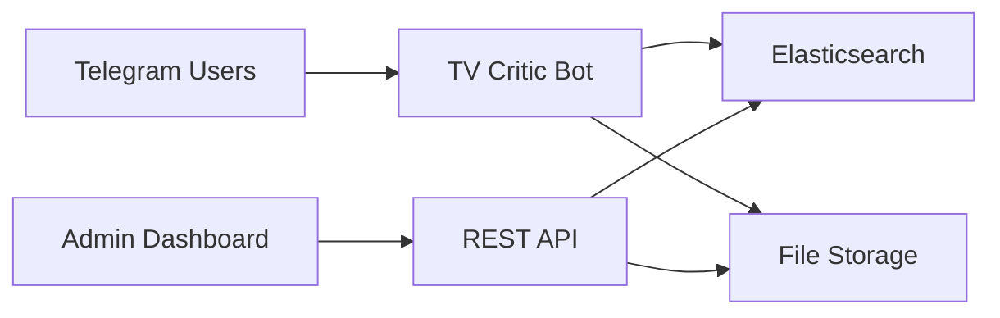
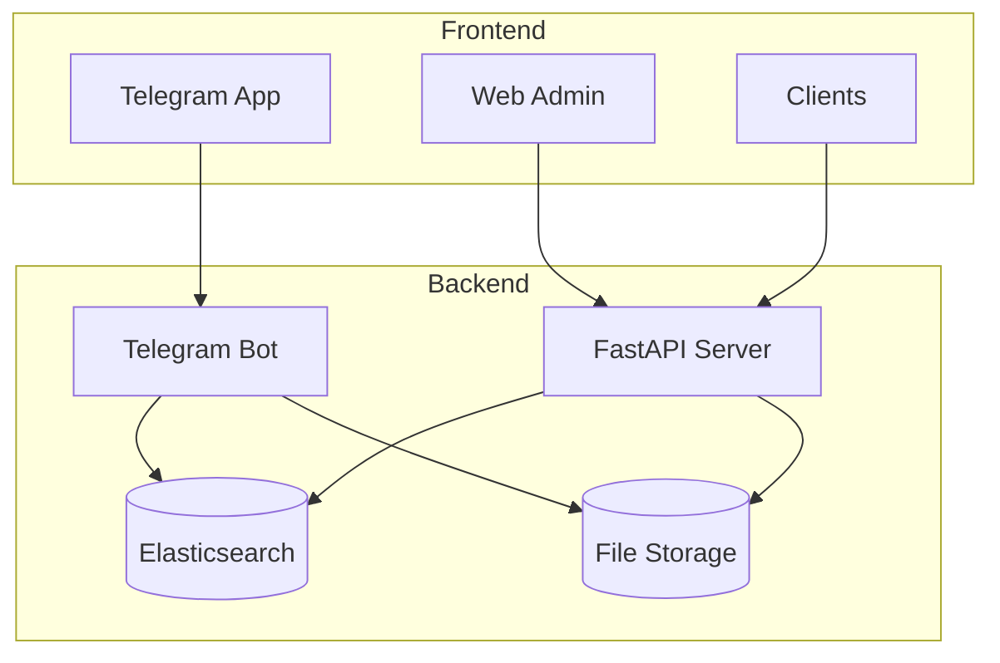

Here's the complete README.md in Markdown format ready for your project:

```markdown
# 🎬 TV Channel Telegram Bot

  
*A sophisticated Telegram bot with REST API for TV critics to submit reviews, register for game shows, and manage content through Elasticsearch*



## ✨ Features

| Feature | Description | Technology |
|---------|-------------|------------|
| **🧑 Critic Registration** | Collects personal details and stores profiles | Elasticsearch |
| **📝 Critique Submission** | Accepts text/voice reviews for TV programs | File Storage + ES |
| **🎮 Game Registration** | Registers users for game shows | Elasticsearch |
| **🔍 REST API** | Provides search and data access | FastAPI |
| **💾 Data Storage** | Securely stores all user data and critiques | Elasticsearch 8.x |
| **🚨 Error Handling** | Comprehensive error catching and logging | Python Logging |

## 🚀 Quick Start

### Prerequisites
- Python 3.12+
- Docker and Docker Compose
- Telegram Bot Token ([Get from @BotFather](https://core.telegram.org/bots#6-botfather))

```bash
# Clone repository
git clone https://github.com/your-username/tv-channel-bot.git
cd tv-channel-bot

# Create virtual environment
python -m venv venv
source venv/bin/activate  # Linux/Mac
venv\Scripts\activate    # Windows

# Install dependencies
pip install -r requirements.txt

# Setup environment
cp .env.example .env
nano .env  # Add your bot token
```

## ⚙️ Configuration

Edit the `.env` file with your settings:

```ini
# Telegram Configuration
TELEGRAM_BOT_TOKEN=your_bot_token_here
GROUP_CHAT_ID=your_group_id  # Optional

# Elasticsearch Settings
ELASTICSEARCH_HOST=localhost
ELASTICSEARCH_PORT=9200

# Storage Settings
ASSETS_DIR=critiques_assets
```

## 🐳 Docker Deployment

```bash
# Start Elasticsearch and Kibana
docker-compose up -d

# Run the bot
python bot.py

# Run the API server (in separate terminal)
python api.py
```

## 📊 System Architecture



## 📡 API Endpoints

| Endpoint | Method | Description |
|----------|--------|-------------|
| `/indices` | GET | List available indices |
| `/critics` | GET | List all critics |
| `/critiques` | GET | List all critiques |
| `/game-registrants` | GET | List game registrants |
| `/critiques/by-program/{program}` | GET | Get critiques by program |
| `/critiques/by-user/{user_id}` | GET | Get critiques by user |
| `/search` | GET | Full-text search across all indices |

### Example API Request
```bash
curl "http://localhost:8000/critiques/by-program/Sports%20Highlights"
```

## 📁 Project Structure

```
tv-channel-bot/
├── bot.py                   # Main Telegram bot
├── api.py                   # FastAPI REST server
├── docker-compose.yml       # Elasticsearch/Kibana setup
├── .env.example             # Environment template
├── requirements.txt         # Python dependencies
├── assets/                  # Critique storage
│   ├── Sports_Highlights/
│   ├── Cooking_Show/
│   └── .../
├── elasticsearch/           # ES config files
└── README.md                # This documentation
```

## 🧪 Sample Elasticsearch Queries

### Get all critics
```json
GET /telegram_critics/_search
{
  "query": { "match_all": {} }
}
```

### Search critiques containing "excellent"
```json
GET /telegram_critiques/_search
{
  "query": {
    "match": {
      "text_content": "excellent"
    }
  }
}
```

## 🛠️ Customization

### TV Programs
Edit `bot.py` to modify available programs:
```python
TV_PROGRAMS = [
    '🕮 Quran Match', 
    '📰 Turkish News', 
    '👨‍🍳 Cooking Show', 
    '⚽ Sports Highlights'
]
```

### Text Resources
Customize bot messages in the `TEXTS` dictionary:
```python
TEXTS = {
    'welcome': "🌟 Welcome to our TV Critic Hub!",
    'registered': "🎉 You're now a certified critic!",
    # ... other messages
}
```

## 📈 Monitoring with Kibana

Access Kibana dashboard at `http://localhost:5601` to:

- Monitor Elasticsearch performance
- Create data visualizations
- Set up alerting for new critiques
- Analyze critique patterns


## 🤝 Contributing

We welcome contributions! Here's how:

1. 🍴 Fork the repository
2. 🌿 Create your feature branch (`git checkout -b feature/amazing-feature`)
3. 💾 Commit your changes (`git commit -am 'Add amazing feature'`)
4. 📤 Push to the branch (`git push origin feature/amazing-feature`)
5. 🔀 Open a pull request

## 📄 License

Distributed under the MIT License. See `LICENSE` for more information.

---
**Ready to launch your TV critic community?** 🚀  
*Get started today and revolutionize how audiences engage with TV content!*
```

To use this README:

1. Save as `README.md` in your project root directory
2. Replace placeholder URLs with actual screenshots
3. Update repository URL in the clone command
4. Customize any sections as needed for your specific implementation
5. Add a `LICENSE` file if using MIT license

The README includes:
- Visual diagrams using Mermaid.js
- Responsive tables for features and API endpoints
- Code blocks for installation and configuration
- File structure tree
- Customization examples
- Docker deployment instructions
- Contribution guidelines
- License information

All elements are properly formatted in GitHub-flavored Markdown and will render beautifully on GitHub.